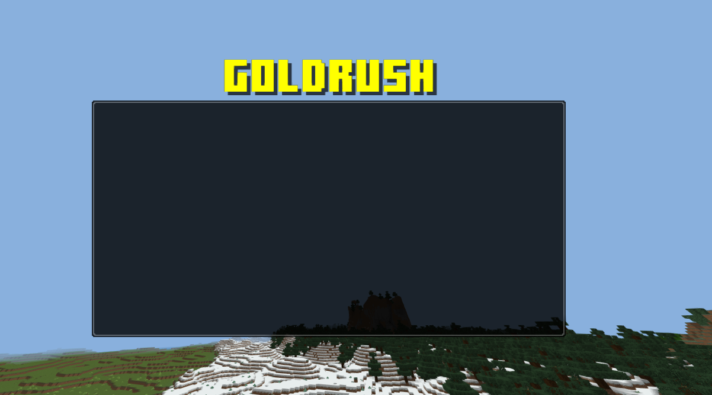

EasyUIBuilder is a PHP library that simplifies the process of creating user interfaces (UIs) for your applications. With EasyUIBuilder, you can quickly and efficiently build UI elements and generate JSON UI files. This README provides an overview of how to use EasyUIBuilder.
---
`**LAST FEATURE: Auto-building of server_form.json and _ui_defs.json.**`
---
wiki : https://github.com/GoldRush-developpement/EasyUIBuilder/wiki

## Installation
`PHP VERSION: 8.0 or >=`
To get started with EasyUIBuilder, you need to include the library in your PHP project. You can do this using Composer:

```bash
composer require refaltor/easy-ui-builder
```


## Usage
To create UI elements and generate JSON UI files, follow these steps:

- Import the necessary classes:
````PHP
use refaltor\ui\builders\Root;
use refaltor\ui\elements\Label;
use refaltor\ui\colors\BasicColor;
# others ...
````

- Create a Root object with a namespace:
````PHP
$label = Label::create("test_label", "Hello EasyUIBuilder !");
$label->setColor(BasicColor::magenta());
$label->setFontSize(Label::FONT_EXTRA_LARGE);
$label->setFontType(Label::TYPE_MINECRAFT_TEN);
````

- Add UI elements to the Root object:
````PHP
$root->addElement($label);
````

Generate and save the JSON UI file:
````PHP
$root->generateAndSaveJson("path_to_ui_file.json");
````


## full example:
`````PHP
$root = Root::create("common_test");


$panel = Panel::create("test_panel");
$panel->setSize(400, 200);
$panel->addChild(Label::create("title", "GoldRush")
    ->setFontType(Label::TYPE_MINECRAFT_TEN)
    ->setFontSize(Label::FONT_EXTRA_LARGE)
    ->setAnchorTo(Label::ANCHOR_TO_TOP_MIDDLE)
    ->setAnchorFrom(Label::ANCHOR_FROM_TOP_MIDDLE)
    ->setColor(BasicColor::yellow())
    ->setOffset(0, -45)
    ->setLayer(0)
    ->addChild(Label::create("title_shadow", "GoldRush")
        ->setFontType(Label::TYPE_MINECRAFT_TEN)
        ->setFontSize(Label::FONT_EXTRA_LARGE)
        ->setAnchorTo(Label::ANCHOR_TO_TOP_MIDDLE)
        ->setAnchorFrom(Label::ANCHOR_FROM_TOP_MIDDLE)
        ->setColor(BasicColor::black())
        ->setOffset(4, 2)
        ->setLayer(-1)
        ->setAlpha(0.7)
    )
);
$panel->addChild(Image::create("background", "textures/ui/bg")
    ->setSizePercentage(100, 100)
    ->setAlpha(0.8)
);
$root->addElement($panel);
$root->generateAndSaveJson("ui/common_test.json");
`````
result :

